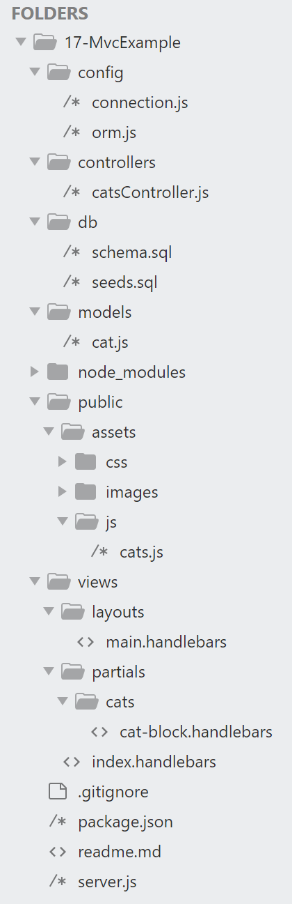

# File structure set up for MVC example in class

# Site Preview


# File Structure for the site


<!-- ### Set up folders and files
* config
	* connection.js
	* orm.js
* controllers
	* catsController.js
* db
	* schema.sql
	* seeds.sql
* models
	 * cat.js
* public
	* assets
		* css
			* style.css
		* js
			* cats.js
* views
	* layouts
		* main.handlebars
	* partials
		* cat-block.handlebars
	* index.handlebars
* package.json
* server.js -->

### Set up Node packages
If starting with this repository, you can use `npm i`

Otherwise you'll need to do the following:
* `npm init`
* `npm install express --save`
* `npm install express-handlebars --save`
* `npm install mysql --save`
* `npm install body-parser --save`

### Recommended order to set up files
1. [db/schema.sql](#schema.sql)
1. [db/seeds.sql](#seeds.sql)
1. [config/connection.js](#connection.js)
1. [server.js](#server.js)
1. [controllers/catsController.js](#catsController.js)
1. [views/layouts/main.handlebars](#main.handlebars)
1. [views/layouts/index.handlebars](#index.handlebars)
1. [public/assets/css/style.css](#style.css)
1. [views/partials/cats/cat-block.handlebars](#cat-block.handlebars)
1. [config/orm.js](#orm.js)
1. [models/cat.js](#cat.js)
1. [public/assets/js/cats.js](#cats.js)

### <a name="schema.sql"></a>schema.sql
Sets up the database and columns for mysql.
```sql
CREATE DATABASE cat_db;
USE cat_db;

CREATE TABLE cats
(
	id int NOT NULL AUTO_INCREMENT,
	name varchar(255) NOT NULL,
	sleepy BOOLEAN DEFAULT false,
	PRIMARY KEY (id)
);

```

### <a name="seeds.sql"></a> seeds.sql
Sets up the seed data for our database created above.
```sql
INSERT INTO cats (name) VALUES ('Meeses');
INSERT INTO cats (name) VALUES ('Bobbi');
INSERT INTO cats (name, sleepy) VALUES ('Sylvester', true);
INSERT INTO cats (name, sleepy) VALUES ('Marilyn Manson', true);
INSERT INTO cats (name, sleepy) VALUES ('Joe Biden', true);
INSERT INTO cats (name) VALUES ('Owens');
```

### <a name="connection.js"></a>connection.js
Requires mysql node package. This connects us to our database so we can access it in our app. The mysql package might be replaced by the node package, sequelize in the rest of our class.
```javascript
// Set up MySQL connection.
var mysql = require("mysql");

var connection = mysql.createConnection({
  port: 3306,
  host: "localhost",
  user: "root",
  password: "",
  database: "cat_db"
});

// Make connection.
connection.connect(function(err) {
  if (err) {
    console.error("error connecting: " + err.stack);
    return;
  }
  console.log("connected as id " + connection.threadId);
});

// Export connection for our ORM to use.
module.exports = connection;
```

### <a name="server.js"></a>server.js
Uses the package express to set up our localhost and/or server wherever we host this site. Uses the package body-parser to get the data from requests (i think). Uses handlebars for templating and creating html via javascript. Imports routes from our controller file to route through the page.
```javascript
var express = require("express");
var bodyParser = require("body-parser");

var PORT = process.env.PORT || 3000;

var app = express();

// Serve static content for the app from the "public" directory in the application directory.
app.use(express.static("public"));

// parse application/x-www-form-urlencoded
app.use(bodyParser.urlencoded({ extended: false }));

// parse application/json
app.use(bodyParser.json());

// Set Handlebars.
var exphbs = require("express-handlebars");

app.engine("handlebars", exphbs({ defaultLayout: "main" }));
app.set("view engine", "handlebars");

// Import routes and give the server access to them.
var routes = require("./controllers/catsController.js");

app.use(routes);

app.listen(PORT, function() {
  console.log("App now listening at localhost:" + PORT);
});
```

### <a name="catsController.js"></a>catsController.js
Requires express and sets up our routing via the router object.

This needs the files in the views folder to really see anything happen. However, starting off, I recommend making this with at least the root directory before adding the api functionalities. Once you route the root directory, you should work on the basic handlebars templates, then revisit this when you work on the api functionality. 

Once the API logic is coded, the API logic for the root directory starts when the page is loaded and automatically does a .get request. This sends a get request which is routed here and calls cat.all from cat.js which calls orm.all from orm.js. orm.all does a mysql query to grab the data from our mysql database. It then passes that data into index.handlebars to render onto the page. 

Upon initial set up of this file, I recommend passing in a defined object with cat data in hbsObject before setting up the orm.js file so we can test if the page renders correctly.

The post put and delete requests are handled via on click event listeners in the cats.js file which is linked to the index.

```javascript
var express = require("express");

var router = express.Router();

// Import the model (cat.js) to use its database functions.
var cat = require("../models/cat.js");

// Create all our routes and set up logic within those routes where required.

router.get("/", function(req, res) {
  cat.all(function(data) {
    var hbsObject = {
      cats: data
    };
    console.log(hbsObject);
    res.render("index", hbsObject);
  });
});

router.post("/api/cats", function(req, res) {
  cat.create(["name", "sleepy"], [req.body.name, req.body.sleepy], function(result) {
    // Send back the ID of the new quote
    res.json({ id: result.insertId });
  });
});

router.put("/api/cats/:id", function(req, res) {
  var condition = "id = " + req.params.id;

  console.log("condition", condition);

  cat.update(
    {
      sleepy: req.body.sleepy
    },
    condition,
    function(result) {
      if (result.changedRows === 0) {
        // If no rows were changed, then the ID must not exist, so 404
        return res.status(404).end();
      }
      res.status(200).end();

    }
  );
});

router.delete('/api/cats/:id', function(request, result){
  var condition = "id = " + request.params.id;
  cat.delete(request.body.id, function(){
    console.log('deleted');
    return result.json({poop:"poop"});
  });
})

// Export routes for server.js to use.
module.exports = router;

```

### <a name="main.handlebars"></a> main.handlebars
Our main handlebar template. Stuff is inserted into the {{{ body }}} section based on our specification in the catsConstroller.js. This requires the logic in cats.js to execute the clicks that happen on our page. The form and buttons are added via handlebars through the next two tiles, index and cat-block.
```html
<!DOCTYPE html>
<html lang="en">
<head>
	<meta charset="UTF-8">
		<link rel="stylesheet" href="/assets/css/style.css" type="text/css" />
		<title>MVC With Cats!</title>
		<script src="https://code.jquery.com/jquery.js"></script>
		<script src="/assets/js/cats.js"></script>
	</head>
	<body>
		{{{ body }}}
	</body>
</html>
```

### <a name="index.handlebars"></a> index.handlebars
Creates a form with cats that are sleepy and that are not sleepy. Uses handlebars functions to do so via {{#each}}. This is a good reference for handlebars syntax. cat-block pulls in the cat-block.handlebars file and passes a new cats[i].sleep boolean.
```html
<h1>Cats!</h1>

<h2>Cats that are not sleepy!</h2>

<!-- calls cat-block.handlebars and injects cats data 
and the newly created cats.sleep boolean -->

<ul>
  {{#each cats}}
    {{#unless sleepy}}
      {{> cats/cat-block sleep=true}}
    {{/unless}}
  {{/each}}
</ul>

<h2>Cats that are sleepy!</h2>

<ul>
  {{#each cats}}
    {{#if sleepy}}
      {{> cats/cat-block sleep=false}}
    {{/if}}
  {{/each}}
</ul>

<h2>Add a Cat</h2>
<form class="create-form">

  <div class="form-group">
    <label for="ca">Cat Name:</label>
    <input type="text" id="ca" name="name">
  </div>

  <div class="form-group">
    <label for="slee">Sleepy?</label><br>
    <input type="radio" name="sleepy" value="1" checked> Sleepy!<br>
    <input type="radio" name="sleepy" value="0"> Awake
  </div>

  <button type="submit">Add Cat</button>
</form>
```

### <a name="style.css"></a> style.css
Put whatever style you want here:
```css
li {
  padding: 5px;
  margin: 5px;
  background: #faebd7;
}

.label {
  font-weight: bold;
}

.create-update-form {
  padding: 5px;
  margin: 5px;
  background: aqua;
}

.form-group {
  margin-bottom: 5px;
}
```

### <a name="cat-block.handlebars"></a> cat-block.handlebars
Using the injected data from index.handlebars, handlebars does its thing. Now, I do think this is a bit superfluous but it does demonstrate how to link to additional handlebar files.
```html
<li>
	{{name}}

	<button class="change-sleep" data-id="{{id}}" data-newsleep="{{sleep}}">
		{{#if sleep}}SLEEP TIME!{{else}}WAKE UP!{{/if}}
	</button>
	<button class="delete" data-id="{{id}}">
		DELETE
	</button>
</li>
```

### <a name="orm.js"></a> orm.js
This might be handled much earlier with sequelize, but here we can flesh out our full mysql orm logic. This custom orm creates connection.query requests.
```javascript
// Import MySQL connection.
var connection = require("../config/connection.js");

// Helper function for SQL syntax.
// Let's say we want to pass 3 values into the mySQL query.
// In order to write the query, we need 3 question marks.
// The above helper function loops through and creates an array of question marks - ["?", "?", "?"] - and turns it into a string.
// ["?", "?", "?"].toString() => "?,?,?";
function printQuestionMarks(num) {
  var arr = [];

  for (var i = 0; i < num; i++) {
    arr.push("?");
  }

  return arr.toString();
}

// Helper function to convert object key/value pairs to SQL syntax
function objToSql(ob) {
  var arr = [];

  // loop through the keys and push the key/value as a string int arr
  for (var key in ob) {
    var value = ob[key];
    // check to skip hidden properties
    if (Object.hasOwnProperty.call(ob, key)) {
      // if string with spaces, add quotations (Lana Del Grey => 'Lana Del Grey')
      if (typeof value === "string" && value.indexOf(" ") >= 0) {
        value = "'" + value + "'";
      }
      // e.g. {name: 'Lana Del Grey'} => ["name='Lana Del Grey'"]
      // e.g. {sleepy: true} => ["sleepy=true"]
      arr.push(key + "=" + value);
    }
  }

  // translate array of strings to a single comma-separated string
  return arr.toString();
}

// Object for all our SQL statement functions.
var orm = {
  all: function(tableInput, cb) {
    var queryString = "SELECT * FROM " + tableInput + ";";
    connection.query(queryString, function(err, result) {
      if (err) {
        throw err;
      }
      cb(result);
    });
  },
  create: function(table, cols, vals, cb) {
    var queryString = "INSERT INTO " + table;

    queryString += " (";
    queryString += cols.toString();
    queryString += ") ";
    queryString += "VALUES (";
    queryString += printQuestionMarks(vals.length);
    queryString += ") ";

    console.log(queryString);

    connection.query(queryString, vals, function(err, result) {
      if (err) {
        throw err;
      }

      cb(result);
    });
  },
  // An example of objColVals would be {name: panther, sleepy: true}
  update: function(table, objColVals, condition, cb) {
    var queryString = "UPDATE " + table;

    queryString += " SET ";
    queryString += objToSql(objColVals);
    queryString += " WHERE ";
    queryString += condition;

    console.log(queryString);
    connection.query(queryString, function(err, result) {
      if (err) {
        throw err;
      }

      cb(result);
    });
  },
  delete: function(table, column, id, cb){
    var queryString = "DELETE FROM ?? WHERE ?? = ?";
    connection.query(queryString, [table, column, id], function(err, result){
      if (err) throw err;
      cb(result);
    });
  }
};

// Export the orm object for the model (cat.js).
module.exports = orm;
```

### <a name="cat.js"></a> cat.js
Cat object model. Used to define cat functions. For this one, they only include callbacks but more functionality can be added to these.
```javascript
// Import the ORM to create functions that will interact with the database.
var orm = require("../config/orm.js");

var cat = {
  all: function(cb) {
    orm.all("cats", function(res) {
      cb(res);
    });
  },
  // The variables cols and vals are arrays.
  create: function(cols, vals, cb) {
    orm.create("cats", cols, vals, function(res) {
      cb(res);
    });
  },
  update: function(objColVals, condition, cb) {
    orm.update("cats", objColVals, condition, function(res) {
      cb(res);
    });
  },
  delete: function(id, cb){
    orm.delete('cats', 'id', id, function(result){
      cb(result);
    })
  }
};

// Export the database functions for the controller (catsController.js).
module.exports = cat;
```

### <a name="cats.js"></a> cats.js
This is the index page's javascript logic, which is imho confusingly named cats.js. This contains the get put and delete requests which we should be coding concurrently into the orm.js and cat.js as we code the requests here.
```javascript
// Make sure we wait to attach our handlers until the DOM is fully loaded.
$(function() {
  $(".change-sleep").on("click", function(event) {
    var id = $(this).data("id");
    var newSleep = $(this).data("newsleep");

    var newSleepState = {
      sleepy: newSleep
    };

    // Send the PUT request.
    $.ajax("/api/cats/" + id, {
      type: "PUT",
      data: newSleepState
    }).then(
      function() {
        console.log("changed sleep to", newSleep);
        // Reload the page to get the updated list
        location.reload();
      }
    );
  });

  $(".create-form").on("submit", function(event) {
    // Make sure to preventDefault on a submit event.
    event.preventDefault();

    var newCat = {
      name: $("#ca").val().trim(),
      sleepy: $("[name=sleepy]:checked").val().trim()
    };

    // Send the POST request.
    $.ajax("/api/cats", {
      type: "POST",
      data: newCat
    }).then(
      function() {
        console.log("created new cat");
        // Reload the page to get the updated list
        location.reload();
      }
    );
  });

  $(".delete").on("click", function(event){
    event.preventDefault();
    var id = $(this).attr('data-id');
    console.log(id);

    var newCat = {
      id:id
    }

    $.ajax("/api/cats/"+id,{
      type: 'DELETE',
      data: newCat
    }).then(
      function(){
        console.log('deleted cat');
        location.reload();
      }
    );
  })
});
```